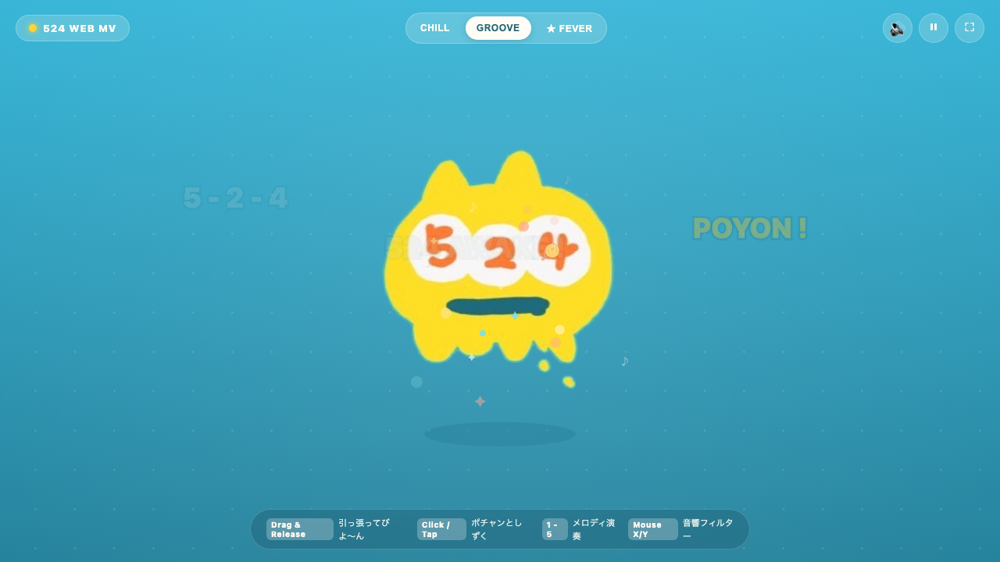

# 524 - Interactive Web Music Video 🎵

キャラクター「**524（ゴー・ツー・フォー）**」の体感・操作連動型インタラクティブWebミュージックビデオです。



## 🌟 特徴
- **外部音源アセット不要**: Web Audio API によるプロシージャル・シンセサイザー（キック、スネア、ベース、アルペジオ、ドリーミーパッド）をリアルタイム生成。
- **生きたアニメーション**: ディズニー12原則（Squash & Stretch）＆ジブリ的自然運動に基づく物理アニメーション。
- **体感・操作連動**:
  - **ドラッグ＆リリース**: つまんで引っ張るとゴムのように伸び、放すと「ビヨ〜ン♪」と跳ね返るスリングショット物理。
  - **画面タップ / クリック**: しずくがポチャンと落ちて波紋とチャイム音を広げる。
  - **マウス移動**: 画面のX/Y座標でリアルタイムに音響フィルター＆ディレイ変調。
  - **キーボード (1〜5)**: ペンタトニックスケールのチャイム演奏。
  - **Space**: ジャンプ＆キックビート。
  - **F**: ★ FEVERモード突入！

## 🛠️ 技術スタック
- **TypeScript / HTML5 Canvas / CSS3**
- **Web Audio API**
- **Vite**
- **Vitest**

## 🚀 ローカル起動
```bash
pnpm install
pnpm dev
```

## 📜 ライセンス
MIT
